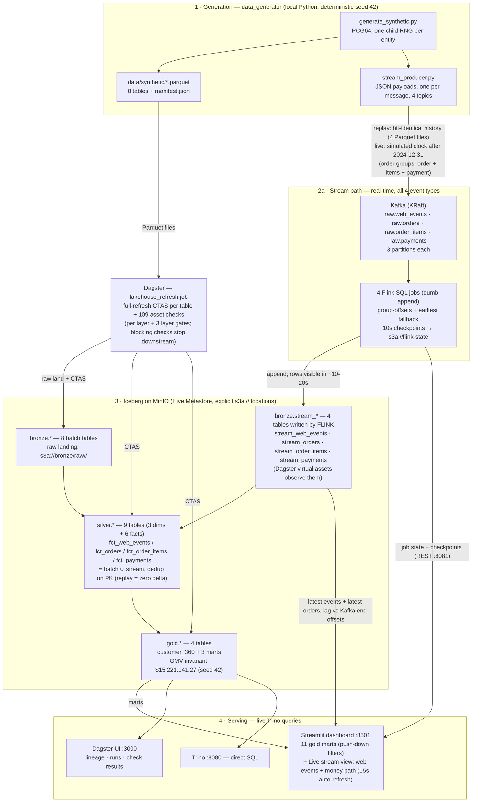

# Data Flow — End to End

This document traces a row of data from generation to chart, step by step,
for every path in the system: the **batch path** (all 8 entities) and the
**streaming path** (web events + the money path: orders, order items,
payments). Every step names the component that does it, where the data
lands, and the command/verifier that proves it.

## Big picture



Storage (MinIO buckets): `bronze/` `silver/` `gold/` `flink-state/`
(`raw/<t>/` + `<t>/` subdirs per table; Flink checkpoints).
Metadata: Hive Metastore (Postgres backend) — catalogs: `iceberg` + `hive`.
Queries: Trino :8080 (catalogs `iceberg`, `hive`).

**Canonical dataset (seed 42):** 5,000 customers · 500 products · 50,000
orders · 96,686 order items · 50,000 payments · 50,000 web events · 300
support tickets, covering 2024-01-01 … 2024-12-31. Five-view revenue
invariant: **$15,221,141.27**.

---

## Stage 0 — One-command startup (`make run`)

`scripts/start_all.py` runs these steps in order, all idempotent:

| # | Step | What it does |
|---|------|--------------|
| 1 | `step_up` | `docker compose up -d` the stack; wait until healthy |
| 2 | `step_data` | run `generate_synthetic.py` (skips if `manifest.json` is fresh) |
| 3 | `step_bootstrap` | `bootstrap_minio.py` — buckets + Trino schemas |
| 4 | `step_stream` | replay the batch history of **all 4 topics** into Kafka (`stream_producer.py --mode replay --if-empty`, per-topic idempotency) |
| 5 | `step_flink` | submit the 4 Flink SQL jobs if not already running |
| 6 | `step_stream_catchup` | poll until all 4 Flink jobs have committed their topics to Iceberg |
| 7 | `step_dashboard` | start Streamlit detached on :8501 (pid in `.logs/dashboard.pid`) |
| 8 | `step_refresh` | `dagster job execute -j lakehouse_refresh` (bronze→silver→gold + 109 checks) |
| 9 | `step_verify` | the 7-script quick verification suite |

The Docker stack (`docker/docker-compose.yml`): `minio`, `postgres`
(Hive Metastore backend), `hive` (metastore, thrift :9083), `trino`,
`kafka` (KRaft single node), `kafka-init` (creates the 4 topics —
`raw.web_events`, `raw.orders`, `raw.order_items`, `raw.payments` — each 3
partitions, replication 1), `flink-jobmanager` + `flink-taskmanager`
(custom image with Iceberg + Kafka + S3A plugins; Flink REST on :8081;
TM = 8 slots / 11 GB so 4 jobs × (source + sink) fit).

---

## Stage 1 — Data generation (deterministic source)

**Component:** `data_generator/generate_synthetic.py` →
`data/synthetic/*.parquet` + `data/synthetic/manifest.json`.

- **Determinism:** one master PCG64 RNG seeded with `DATA_SEED` (42) spawns
  one child RNG per entity, so each table's rows depend only on the seed —
  never on generation order or other tables' sizes. `manifest.json` records
  per-table row counts + content hashes; the bronze `manifest_rows` DQ
  check asserts the ingested counts against it.
- **Entities (8 Parquet files):** `customers` (5,000), `products` (500),
  `orders` (50,000), `order_items`, `payments`, `refunds`,
  `web_events` (50,000), `support_tickets` (300).
- **Business rules baked in** (the material Silver/Gold must clean,
  validate or exploit):
  - Zipf-like purchase popularity → a few heavy-buyer customers;
  - Nov/Dec order-volume bump (holiday season);
  - cancelled orders always carry a **failed** payment; returned orders
    carry a **refund** (refunds may land after the data range — lag);
  - ~30% of web events are anonymous (`customer_id` NULL by design);
  - web events: 6 types (`page_view` 55%, `search`, `add_to_cart`,
    `checkout`, `purchase`, `wishlist`), 3 devices (desktop/mobile/tablet),
    8 product categories.

---

## Stage 2 — Bootstrap (idempotent storage/layout)

**Component:** `scripts/bootstrap_minio.py` (`make bootstrap`).

- Creates MinIO buckets: `bronze`, `silver`, `gold`, `flink-state`.
- Creates the Trino/Hive schemas: `bronze`, `silver`, `gold` (iceberg
  catalog) and `bronze_raw` (hive catalog) via `scripts/create_schemas.sql`.
- Every Iceberg table gets an **explicit S3 location**
  (`s3a://<bucket>/<table>`) — Trino's native filesystem cannot reach the
  HMS warehouse (`file://`) fallback, so locations are always stated.

---

## Stage 3 — Batch ingestion (bronze layer)

**Component:** Dagster assets `bronze.<table>` (one per entity), executed by
the `lakehouse_refresh` job. Each asset does three things
(`assets/bronze/__init__.py::_ingest_table`):

1. **Land raw:** upload `data/synthetic/<table>.parquet` to the immutable
   landing zone `s3a://bronze/raw/<table>/<table>.parquet` (MinIO).
   Re-runs overwrite the same object — byte-stable because the generator is
   deterministic.
2. **Register:** (re)create a Trino **Hive external table**
   `hive.bronze_raw.<table>` over that raw directory, with the column DDL
   **inferred from the actual Parquet schema** (`pl.read_parquet_schema`)
   so the DDL always matches the data.
3. **Load:** full-refresh into Iceberg:
   `DROP TABLE IF EXISTS iceberg.bronze.<table>` +
   `CREATE TABLE ... WITH (format='PARQUET', location='s3a://bronze/<table>')
   AS SELECT * FROM hive.bronze_raw.<table>`.

Result: `iceberg.bronze.{customers, products, orders, order_items, payments,
refunds, web_events, support_tickets}` — 8 tables, row counts identical to
the manifest.

**The 4 stream bronze tables are different:**
`iceberg.bronze.stream_web_events`, `stream_orders`, `stream_order_items`
and `stream_payments` are written by **Flink**, not Dagster (see Stage 4).
Dagster holds one **virtual observer** asset per stream table — each op
queries the table's existence/row count/distinct PK/date range through
Trino and reports run metadata (it fails with "run `make flink-up`" if the
Flink job never ran). They exist so the stream sources show up in lineage
as real upstreams of silver's merges, and the stream DQ checks (PK
uniqueness, `consumer_lag`, cross-source dups) attach to them.

---

## Stage 4 — Streaming path (web events + money path)

### 4a. Producer → Kafka

**Component:** `data_generator/stream_producer.py` → 4 topics (3 partitions,
replication 1 each): `raw.web_events`, `raw.orders`, `raw.order_items`,
`raw.payments`.

Payload = one JSON object per message, identical schema to the batch
Parquet:

```json
{"event_id": "EVT-00000001", "customer_id": "C-000001" | null,
 "event_type": "page_view", "category": "Electronics",
 "device": "desktop", "event_date": "2024-03-15"}

{"order_id": "ORD-0000001", "customer_id": "C-000006",
 "order_date": "2024-03-28", "order_status": "completed",
 "channel": "mobile", "total_amount": 280.78}

{"order_item_id": "OI-00000001", "order_id": "ORD-0000001",
 "product_id": "P-00431", "quantity": 4, "unit_price": 27.92,
 "line_total": 111.68}

{"payment_id": "PAY-0000001", "order_id": "ORD-0000001",
 "payment_method": "credit_card", "payment_status": "succeeded",
 "payment_date": "2024-03-28", "amount": 280.78}
```

Two modes:

- **replay** (used by `make run` / `make reseed`): emits the full seeded
  history of **all 4 tables** (web_events, orders, order_items, payments)
  at maximum speed. Every emitted payload set is **bit-identical** to its
  batch Parquet file — after replay + refresh, every streamed row is deduped
  out in silver, so streaming leaves a **zero delta** on all invariants
  (verified per topic by `scripts/verify_kafka.py`).
- **live** (demo, `make stream-up`): optionally replays history first
  (`--if-empty` skips it **per topic** when the topic already has messages),
  then emits NEW rows on **simulated clocks** continuing after each table's
  `max(date)` — no wall clock anywhere. Content is fully determined by
  `(seed, live counts)`; `--rate` (20 events/s) and `--order-rate`
  (2 order groups/s) only pace wall-clock arrival. Live rows are generated
  as **consistent order groups**: one order + its 1–5 items + exactly one
  payment, all sharing the same simulated `order_date`:
  - ids continue the batch sequences (`ORD-0050001…`, `OI-00096687…`,
    `PAY-0050001…`);
  - customer sampled from the historical order-customer pool, product from
    the historical product pool with the batch price jitter (FK-valid);
  - `total_amount = Σ line_total` (so the 5-view revenue invariant holds for
    live orders too);
  - status is completed/cancelled only — **no `returned`** (refunds stay
    batch-only by design); cancelled ⇒ failed payment, mirroring the batch
    rule; else 97% succeeded / 3% pending.

### 4b. Kafka → Flink → Iceberg

**Component:** one Flink SQL job per topic (4 jobs total), e.g.
`insert-into_iceberg.bronze.stream_orders`
(`flink/sql/stream_orders.sql`, all submitted by `make flink-up`).

Each job is a **dumb append** — no dedup, no conformance; silver is the
merge point (design decision, see PROJECT.md "Streaming design decisions").

- **Source:** Flink Kafka connector on the topic (`kafka:9094`, the
  container-internal listener), JSON format, consumer group
  `bronze.stream_<key>`.
  - `scan.startup.mode=group-offsets` → a restarted job resumes from the
    offsets committed on graceful cancellation (no re-read);
  - `properties.auto.offset.reset=earliest` → a freshly reset topic
    (after `make reseed`) has no group offsets, so the job falls back to
    earliest and replays the whole history — exactly what the rebuilt
    table needs (without this the consumer crash-loops with
    `NoOffsetForPartitionException`).
- **Sink:** `iceberg.bronze.stream_<key>` (Iceberg format v2, Parquet,
  location `s3a://bronze/stream_<key>`).
  `stream_web_events` / `stream_orders` / `stream_payments` are
  `PARTITIONED BY` their date column (Flink's Iceberg catalog supports
  identity partitioning only; for a DATE column this is physically
  identical to `day(x)`, so the layout matches the batch bronze tables).
  `stream_order_items` carries **no date column** and is unpartitioned
  (one always-open write partition — cheap on checkpoint memory).
- **Capacity:** the task manager runs **8 slots / 11 GB** so all 4 jobs'
  (Kafka source + Iceberg sink) tasks fit side by side; each open
  parquet/zstd writer per date partition is why the heap must stay well
  above 4 GB (the 340–366 distinct date partitions of a replay OOMed a
  2-slot/4 GB TM before its first checkpoint).
- **Durability (Phase 15):** checkpoints every 10s to
  `s3a://flink-state/checkpoints/<jobId>/` (S3A via the hadoop plugin +
  mounted `core-site.xml`), retained on cancellation. Iceberg snapshots are
  committed at checkpoints, so new rows are **visible in Trino within
  ~10–20s**; a stop/start never re-appends history, and only an ungraceful
  kill can produce at-least-once duplicates (silver dedups; the
  `<pk>_unique` stream checks surface them).

### 4c. Visibility in Dagster

The 4 virtual `bronze/stream_*` assets (Stage 3) make the Flink outputs part
of the asset graph; per-stream `consumer_lag` checks (Stage 7) watch
committed rows vs each topic's end offset.

---

## Stage 5 — Silver (conformed layer, spec-driven)

**Component:** `assets/silver/sql.py` (9 specs) → factory
`assets/factory.py` builds one Dagster asset per spec. Every asset is a
**full refresh**: `DROP TABLE` + `CREATE TABLE iceberg.silver.<name>
AS ...`, bracketed by `pre_stats`/`post_stats` scalar queries that land in
run metadata (rows in/out, duplicates removed, orphans dropped — every
transformation is measurable).

Dimensions (dedup on natural key, `lower(trim())` enums, money as
`DECIMAL(12,2)`):

| Table | From | What it does |
|-------|------|--------------|
| `dim_customers` | bronze.customers | trims names, lowercases email/channel, **dedups on email** (earliest signup wins via `row_number`) |
| `dim_products` | bronze.products | trims name/category/brand, `DECIMAL(12,2)` price, **drops non-positive prices** |
| `dim_order_dates` | bronze.orders | calendar spanning the observed order range: year/month/quarter/weekday + `is_holiday_season` (Nov/Dec) |

Facts (inner-join where referential integrity is a business guarantee —
orphans dropped and **counted** in pre_stats):

All four streamed facts share the **merge pattern**: `UNION ALL` the batch
and stream bronze sources, `row_number() OVER (PARTITION BY <pk> ORDER BY
src_rank)` with batch ranked 1 (identical payload per PK, no arrival
timestamp — the rank only makes the dedup deterministic) → **replay is a
zero-delta no-op, live rows extend the facts**.

| Table | From | What it does |
|-------|------|--------------|
| `fct_orders` | (orders ∪ stream_orders) ⋈ customers + (order_items ∪ stream_order_items), (payments ∪ stream_payments) | one row per order; item counts across both item sources; status flags; first payment per order; `payment_status_conflict` (cancelled ⇔ failed) |
| `fct_order_items` | (order_items ∪ stream_order_items) ⋈ (orders ∪ stream_orders) ⋈ dim_products | denormalized product attrs; `line_total_mismatch` (qty×price ≠ line_total) |
| `fct_payments` | (payments ∪ stream_payments) ⋈ (orders ∪ stream_orders) | **dedup to one row per order** (batch wins, then lowest payment_id); amount vs order-total `amount_mismatch` flag |
| `fct_refunds` | refunds ⋈ orders | `refund_lag_days`, `is_full_refund` (refund ≥ order total) — batch-only (live orders are never returned) |
| `fct_web_events` | bronze.web_events **∪ bronze.stream_web_events** | **the merge point**: dedup on `event_id` → **replay is a zero-delta no-op, live events extend the facts**; anonymous sessions kept and flagged (`is_anonymous`) |
| `fct_support_tickets` | support_tickets + orders | `has_linked_order` / `linked_order_valid` (order belongs to that customer) |

Ordering within the layer: dimensions first, then facts that join them
(`local_deps`), so the parallel executor never reads a table mid-refresh.

---

## Stage 6 — Gold (Customer 360 marts)

**Component:** `assets/gold/sql.py` (4 specs), all reading `iceberg.silver.*`.
Conventions: "as-of" = `max(order_date)` in silver (deterministic, no
wall clock); revenue = non-cancelled orders only; net = gross − refunds.

| Table | Shape | Content |
|-------|-------|---------|
| `customer_360` | 1 row per customer | demographics; total/completed/returned/cancelled/valid orders; first/last order date; gross/total_refunded/**net_revenue**; AOV; items; recency_days; **RFM**: quintile scores 1–5 over customers with orders (R on recency asc, F on valid_orders asc, M on net_revenue asc) → 8-value `rfm_segment` rule map (champion, loyal, new_or_returning, potential_loyalist, hibernating, needs_attention, lost, no_orders); **churn risk**: recency ÷ customer's own avg inter-order gap (fallback: global avg) — <1.5 low, <2.5 medium, else high (no orders → none); tickets + web engagement (`total_web_events`, `cart_adds`, `last_event_date`) |
| `revenue_by_channel` | month × channel | orders by status, gross/refunds/net revenue, AOV, return/cancel rates |
| `revenue_by_category` | month × category | distinct orders, units, gross revenue, `revenue_share_pct` per month |
| `monthly_kpis` | month | volumes, status mix, gross/net revenue, AOV, return/cancel rates, unique/new/returning customers |

The **five-view revenue invariant** (enforced by the blocking
`revenue_invariant` check): the non-cancelled `total_amount` sum in
silver.fct_orders plus the `gross_revenue` sums of customer_360,
monthly_kpis, revenue_by_channel and revenue_by_category must all agree —
$15,221,141.27 for seed 42. Because live orders carry a complete item set,
this holds **with live money streaming** too (spread 0.0000).

---

## Stage 7 — Data quality (109 asset checks, inside the refresh)

**Component:** `assets/checks.py` — spec list → factory that attaches
Dagster **asset checks** to assets. Executed by the same `lakehouse_refresh`
run (asset jobs, not in-process `materialize()`), with a **parallel
executor** — which is why each layer also has a `__layer_gate__` barrier
asset: cross-table checks attach to the gate so they run only after *all*
tables of the layer committed (otherwise a check could read a sibling table
inside its drop window).

Check families (28 assets, 3 gates, 109 checks):

| Family | Condition | Example | Blocking? |
|--------|-----------|---------|-----------|
| Bronze: not empty / PK unique / manifest rows | `positive` / `zero` / `manifest` | `pk_unique`, `manifest_rows` (vs `manifest.json`) | PK + manifest **blocking** |
| Bronze: date range freshness | `range_cover` | order/event date span covers expected range | no |
| Bronze: referential integrity (on gate) | `zero` | `order_items_refs_orders`, `payments_refs_orders`, … | **blocking** |
| Bronze: stream health (per stream, 4 streams) | `zero` / `kafka_lag` / `info` | `<pk>_unique` (at-least-once duplicates), `consumer_lag` (committed rows vs topic end offset, tolerance ±1,000 — a stream-health signal, never a batch gate), `<t>_cross_source_dups` | no |
| Silver: not empty / key unique / not null | `positive` / `zero` | `unique_event_id` on fct_web_events | not_empty + unique **blocking** |
| Silver: referential integrity (on gate) | `zero` | `fct_order_items_refs_dim_products`, … | **blocking** |
| Silver: business rules | `zero` | line-total mismatches, amount mismatches, invalid linked orders | no |
| Silver: stream merge (per merged fact) | `zero` / `boolean_true` | `stream_customers_fk`, `stream_order_items_products_fk`, `<fct>_merge_reconcile` (merged = batch ∪ stream, deduped) | no |
| Gold: one row per customer / customer_id unique (gate) | `boolean_true` / `zero` | `one_row_per_customer` | **blocking** |
| Gold: score/segment domains | `zero` | `rfm_score_range`, `segment_domain`, `churn_domain` | no |
| Gold: **revenue invariant** (on gate) | `gmv_spread` | the five views must agree — holds with live money too | **blocking** |
| Gold: freshness / reconciliations / anomaly | `max_month` / `boolean_true` / `z_lt_3` | `freshness` (live-aware: `>=` end month), `orders_reconcile`, `monthly_anomaly` (z-score < 3 over historical months only — a live tail month is partial and would always trip) | no |

A failed **blocking** check stops that asset's downstream chain;
non-blocking failures are reported without stopping the run. The heavy DQ
suite (`make verify-dq`) adds 27 pure unit tests for the evaluators plus a
failure-path test (poisoned input → the right checks trip).

---

## Stage 8 — Serving

### Streamlit dashboard (`:8501`, `dashboard/app.py` + `marts.py`)

Two views (sidebar toggle):

- **Customer 360 (gold):** 4 KPI cards + 6 charts + top-25 customer profile,
  backed by **11 versioned Trino mart queries** (`kpi_customers`,
  `kpi_orders`, `kpi_gmv`, `kpi_aov`, `ltv_distribution`,
  `churn_risk_mix`, `rfm_segment_mix`, `revenue_trend`, `channel_mix`,
  `category_mix`, `customer_sample`). Sidebar filters (order channel,
  acquisition channel, churn risk, month range) and customer search are
  **pushed down into the mart SQL** (`build_sql(name, filters)`), not
  post-filtered in Python. `st.cache_data(ttl=300)` + manual refresh.
- **Live stream:** auto-refreshing every 15s (`st.fragment`): web-event
  Flink job state + completed checkpoints (REST :8081), committed stream
  rows vs Kafka end offset (lag), self-measured event rate, gold
  batch/stream/merged counts, and the 15 latest events straight from
  `iceberg.bronze.stream_web_events`; plus a **money-path section**: a
  per-stream table (orders / order_items / payments — Flink job state,
  Kafka end offset, committed rows, uncommitted) and the 15 latest orders
  from `iceberg.bronze.stream_orders`.

### Dagster UI (`make dev`, `:3000`)

Asset graph with full lineage: 8 batch bronze ingests + 4 virtual stream
assets → 9 silver → 4 gold (28 assets + 3 layer gates), each with its
checks; 4 jobs (`bronze_refresh`, `silver_refresh`, `gold_refresh`,
`lakehouse_refresh`); per-run metadata (rows in/out, rule effects) on every
op.

### Direct querying

Trino :8080 (user `admin`, catalog `iceberg`); MinIO console :9001;
Flink UI :8081.

---

## Operations — how the paths interact

### `make reseed SEED=<n>` (full rebuild, SEED=42 = canonical)

1. delete `data/synthetic/`, regenerate with the new seed;
2. `flink-down` (graceful cancel of all 4 jobs → group offsets committed);
3. `scripts/reset_stream.py` (drop the 4 stream Iceberg tables + purge
   leftover S3 objects);
4. `stream_producer.py --mode replay --reset-topic` (all 4 topics deleted +
   recreated, each history replayed at max speed);
5. `flink-up` (fresh topics → no group offsets → `earliest` fallback →
   clean full replay into the rebuilt tables);
6. `verify_stream.py` (poll until all 4 caught up, no duplicates);
7. `make refresh` (full batch pipeline, 109 checks);
8. `make verify` (7-script suite).

### `make stream-up` / `make stream-down` (live demo)

Starts the producer in **live mode** (`--if-empty` per topic: history
preamble only if the topic is empty) in the background. New web events
(20/s) and new **order groups** (2/s: order + items + payment) flow
producer → Kafka → Flink → Iceberg within ~10–20s; silver picks them up on
the next refresh (merged, deduped); the dashboard's Live view shows them
tick in (web events + latest orders), and the gold marts extend —
`customer_360.last_event_date` / `last_order_date` move past the batch
range on the next refresh.

### `make maintain` (Iceberg upkeep, Phase 15)

Per Iceberg table: `ALTER TABLE ... EXECUTE expire_snapshots`
(older than 1h; skipped below 3 snapshots) + `remove_orphan_files` (older
than 2h), with a MinIO size report before/after. Needed because the stream
table gains a snapshot on **every Flink checkpoint** (10s interval) even
while idle; the retention margins stay far above the checkpoint interval so
in-flight files are never touched. Tunables: `MAINTAIN_SNAPSHOT_AGE`,
`MAINTAIN_ORPHAN_AGE`.

### `make verify` (quick suite, 7 scripts)

| Script | Proves |
|--------|--------|
| `verify_lakehouse.py` | all 11 marts execute; KPI invariants (5,000 customers, 50,000 orders, GMV $15,221,141.27, 12 months, 3 channels, 8 categories) |
| `verify_kafka.py` | all 4 topics' content is the seeded history — bit-identical to batch (replay); live rows continue the id sequences |
| `verify_stream.py` | all 4 Flink jobs caught up (committed ≥ topic end offset), each stream table duplicate-free |
| `verify_bronze.py` | bronze row counts = manifest; bronze_raw landings present |
| `verify_silver.py` | merge invariants for all 4 merged facts (batch ⊆ merged ⊆ batch ∪ stream, live-aware bounds) |
| `verify_gold.py` | five-view revenue invariant + mart shapes (live-aware month bounds) |
| `verify_dashboard.py` | dashboard health + live-panel data sources (Flink REST ×4, Kafka offsets ×4, stream counts, latest orders) |

---

## A row's journey (one web event, both paths)

1. **Generation:** `generate_synthetic.py` (seed 42, child RNG for
   web_events) writes row `EVT-00000421` into `data/synthetic/web_events.parquet`;
   the same value is recorded in `manifest.json`.
2a. **Batch:** bronze asset uploads the Parquet to
   `s3a://bronze/raw/web_events/`, registers `hive.bronze_raw.web_events`,
   CTAS-loads `iceberg.bronze.web_events` (50,000 rows; `manifest_rows`
   check passes); silver `fct_web_events` unions it with the stream source
   and dedups on `event_id`; gold `customer_360` aggregates it into
   `total_web_events` / `cart_adds` / `last_event_date` for that customer.
2b. **Stream:** `stream_producer.py --mode replay` emits the identical JSON
   to Kafka topic `raw.web_events`; Flink appends it to
   `iceberg.bronze.stream_web_events` at the next checkpoint (≤10s); silver
   `fct_web_events` sees the same `event_id` in both sources — `src_rank`
   keeps the batch row, the streamed copy is dropped (**zero delta**).
    In **live mode** the event is a NEW id (`EVT-00050xxx`) with a simulated
    `event_date` after 2024-12-31: it survives dedup, extends
    `fct_web_events`, and the next refresh pushes `customer_360.last_event_date`
    into 2025 — visible in the dashboard's Live view and the gold marts.

## A row's journey (one order, both paths)

1. **Generation:** `generate_synthetic.py` (seed 42) writes order
   `ORD-0000001` (customer `C-000006`, `total_amount` 280.78) into
   `orders.parquet`, its items into `order_items.parquet`, and its payment
   `PAY-0000001` into `payments.parquet`.
2a. **Batch:** the 3 bronze assets land + CTAS-load the three tables; silver
   merges each with its stream source (dedup on `order_id` /
   `order_item_id` / `payment_id`), `fct_orders` joins the customer +
   item-count + first-payment aggregates; gold `customer_360`,
   `monthly_kpis`, `revenue_by_channel` and `revenue_by_category` all pick
   up the order — and the five views agree (revenue invariant).
2b. **Stream:** `stream_producer.py --mode replay` emits the identical JSON
   for the order, its items and its payment into the 3 money topics; the 3
   Flink jobs append them to `stream_orders` / `stream_order_items` /
   `stream_payments` at the next checkpoint (≤10s); silver sees the same PKs
   in both sources — `src_rank` keeps the batch rows, the streamed copies
   are dropped (**zero delta**, revenue invariant holds with spread 0.0000).
   In **live mode** the order group is NEW ids (`ORD-0050xxx` + items +
   `PAY-0050xxx`) with a simulated `order_date` after 2024-12-31, customer
   + products sampled from the historical pools (FK-valid), total = Σ items,
   and one payment (cancelled ⇒ failed): it survives dedup, extends
   `fct_orders` / `fct_order_items` / `fct_payments`, and the next refresh
   pushes `customer_360.last_order_date` and the gold marts forward — while
   the five-view revenue invariant still holds, because the live order
   carries a complete item set. Visible in the dashboard's Live view
   (latest-orders table) and the gold marts.
